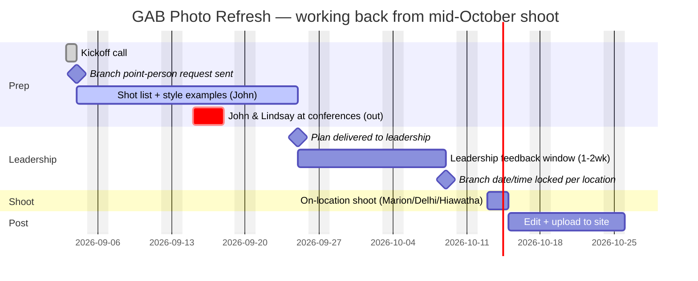

# GreatAmerica Bank Website Photo Refresh — Project So Far

Consolidated 2026-09-04. Combines the project plan, the site photo audit, the 9/3 kickoff transcript, and the branch point-person email draft into one file. Individual source files remain in this folder if you need to link to just one piece.

---

## 1. Project Plan

Ongoing project — kicked off 2026-09-03, on-location shoot targeted **mid-October 2026** (pushed back from an earlier date by Chris Carlson's exterior signage timeline). Replaces the stock photography on greatamericabank.com with licensed/on-location editorial photos across the three branches (Marion, Delhi, Hiawatha).

**Team:** John Wiedenheft (site/shot-list owner), Jessen (photographer, on-site), Ben (directing/b-roll/drone).

### Timeline

Worked backward from a mid-October shoot. Key constraint: **John and Lindsay are both out Sep 15-18** (different conferences) — that week is dead for prep progress and for any leadership decision-making, so the plan doesn't lean on it.

*(Shoot date is still "mid-October," pending Chris Carlson's signage timeline — Oct 13-15 shown as a placeholder. Delivering the plan by 9/25 leaves the full 2-week feedback window before that, with the blackout week already excluded from Lindsay's side. Branch point-person replies are needed by ~10/9 too, so the actual shoot day/time is locked before the crew travels.)*

### Decisions from the kickoff call
- **Style target:** editorial, not stock — same bar as GA.com's editorial photography. US Bank's site was cited as an aspirational benchmark (well-composed, not on-the-nose "banking" imagery, not a small thumbnail).
- **Priority order:** hero images first (biggest visual impact, currently gradient-behind-stock or small thumbnails), then location/branch shots, then personal-banking interaction shots, then business-banking.
- **Interaction scenarios to shoot:** teller desk, drive-through, loan officer's desk — identified as the three core personal-banking scenarios.
- **Community/place shots:** welcome-to-town signage (Marion, Delhi), downtown/Main Street shots, Thomas Park, the pedestrian bridge — meant to signal "place in the community," not literally "bank."
- **Building exteriors:** add people to establishing shots so they don't read as just architecture; Ben to bring a drone for aerial/establishing shots of each branch.
- **Mobile app imagery:** still likely a generic "person holding phone" stock/mockup shot — low priority, but it's a repeating module across the site so worth getting a good one.
- **Approval-first, not shoot-first:** explicit call-out that leadership (Lindsay, and whoever else) doesn't offer opinions on bank marketing until something's already wrong (referenced Scott Geistkemper's post-launch "why is this stock photography" email as the cautionary example). Plan is to build a mood board + shot list and get sign-off *before* spending three shoot days on it.

### Action items
| Owner | Item | Due |
|---|---|---|
| John | Email Lindsay, Tammy, Brian Bjella requesting a point person at each branch (Marion, Delhi, Hiawatha) to schedule shoot date/time | Sent 2026-09-04 (draft below) |
| John | Follow up on point-person email if no reply | By 2026-09-11 (before the 9/15-18 blackout) |
| John | Build page-by-page shot list from the photo audit (which stock images get replaced, with what) | 2026-09-25 |
| John | Pull editorial-style examples from other bank websites for the mood board | 2026-09-25 |
| John | Present full plan/mood board to leadership (Lindsay, Tammy, Brian) | 2026-09-25 |
| Jessen | Line up bank employees willing to be photographed (mentioned: Seth, Barb as possibles) | Before shoot |
| Jessen + Ben | On-location shoot, 3 branches, incl. b-roll/video footage | Mid-October |
| Ben | Drone exterior/establishing shots per branch | Mid-October |

### Open questions
- **Who actually approves this?** John: "I don't know who's involved" — John owns the bank site "on paper," per Lindsay — but Scott/Martin/Adrian may also need to weigh in on approval. Same ownership-gap pattern as the MKB board prioritization issue elsewhere in the org.
- **Can GreatAmerica (parent co.) employees appear on the bank site**, or does it stay strictly the ~10-12 bank employees? Raised by Jessen, traces back to an Adrian email; unresolved.
- **Who's the "face" for business banking?** Tammy suggested (family sold the bank to GreatAmerica) but described as "less photogenic" — no clear alternative identified.
- **Foliage timing risk:** mid-October shoot may land after peak fall color; Ben noted AI tools (Artlist) could adjust season in post if needed.
- Existing employee headshots (Turpen, Golobic already used in the audit) — worth checking what's usable before scheduling new sessions for those people specifically.

---

## 2. Branch Point-Person Email (Draft, sent 2026-09-04)

To: Lindsay, Tammy, Brian Bjella
Subject: GreatAmerica Bank website photo shoot, need a point person per branch

> Hi all,
>
> Jessen, Ben, and I are kicking off the photo refresh for greatamericabank.com, replacing the stock photography across the site with on location photos and video from Marion, Delhi, and Hiawatha. We're targeting mid October for the actual shoot, still pending final confirmation on the exterior signage timeline at each location.
>
> Before that, we're putting together a full plan, a shot list plus style examples, and we'll get that in front of you by the end of September, with one to two weeks after that for your feedback before we lock anything in.
>
> One thing we need now, ahead of the plan itself: a point person at each branch who can help us land on a date and time once we're ready to schedule. Could you let us know who that should be at Marion, Delhi, and Hiawatha? We want to make sure we pick a day when staff are actually in the office.
>
> Happy to answer any questions in the meantime.
>
> Thanks!
> John

---

## 3. Site Photo Audit (2026-09-03)

Source: `sitemap.xml` (HubSpot-generated, includes per-page image data — no crawl needed, sitemap is authoritative for indexed pages).

- **33 pages** in the sitemap
- **777 total image references**, 126 unique image files
- Of those, **65 unique photos** (`.jpg`/`.jpeg` — GreatAmerica's "Licensed Images" stock photo set, plus 2 staff headshots and 1 building photo). Everything else (27 unique `.svg`, 33 unique `.png`, 1 `.webp`) is icons, logos, app-store badges, or the location map graphic — not photography.
- All photos live under `greatamerica.com/hubfs/...` (shared HubSpot file manager), not a bank-specific subdomain.

**Pages with no licensed photo:** `/calculators/compoundsavings`, `/calculators/mortgageloan`, `/calculators/mortgagequalifier`, `/calculators/retirementplan`, `/calculators/simpleloan`, `/resources-rates` — these are form/table pages with icon-only imagery.

### Page → Photo table

| Page URL | Photo Caption | File |
|---|---|---|
| / | Home Banner4 | Home Banner4.jpg |
| / | Home Banner3 | Home Banner3.jpg |
| / | Mobile-on-go | Mobile-on-go.jpg |
| / | Home Banner1 | Home Banner1.jpg |
| / | house | house.jpg |
| /about | Headshot | Headshot.jpeg |
| /about | Heritage Bank Marion 2025 edit | Heritage Bank Marion 2025 edit.jpg |
| /about | MNGolobic-600x600 | MNGolobic-600x600.jpg |
| /about | JTurpen-600x600 | JTurpen-600x600.jpg |
| /brella-terms-of-use-agreement | BrellaTM TERMS OF USE AGREEMENT | BrellaTM TERMS OF USE AGREEMENT.jpg |
| /business-checking | Business Checking Banner | Business Checking Banner.jpg |
| /business-credit-cards | Business Credit card Page | Business Credit card Page.jpg |
| /business-other-services | Business Banking Col2 | Business Banking Col2.jpg |
| /business-other-services | Business Banking Col1 | Business Banking Col1.jpg |
| /business-other-services | Business Banking Col3 | Business Banking Col3.jpg |
| /business-other-services | Business Banking Col | Business Banking Col.jpg |
| /business-other-services | Business Other Services Banner | Business Other Services Banner.jpg |
| /business-savings-and-money-market | Business Savings Page | Business Savings Page.jpg |
| /calculators/compoundsavings | *(no licensed photos)* | — |
| /calculators/mortgageloan | *(no licensed photos)* | — |
| /calculators/mortgagequalifier | *(no licensed photos)* | — |
| /calculators/retirementplan | *(no licensed photos)* | — |
| /calculators/simpleloan | *(no licensed photos)* | — |
| /consumer-privacy | Privacy Banner | Privacy Banner.jpg |
| /loans-business | Farm Service Agency | Farm Service Agency.jpg |
| /loans-business | Construction | Construction.jpg |
| /loans-business | Loans-Business | Loans-Business.jpg |
| /loans-business | Real Estate | Real Estate.jpg |
| /loans-business | accounts receivable or seasonal lines of credit | accounts receivable or seasonal lines of credit.jpg |
| /loans-business | Equipment financing | Equipment financing.jpg |
| /loans-business | Equipment Loans | Equipment Loans.jpg |
| /loans-business | Letters of Credit | Letters of Credit.jpg |
| /loans-business | occupied rental | occupied rental.jpg |
| /loans-business | Operating Lines of Credit | Operating Lines of Credit.jpg |
| /loans-business | Livestock Loans | Livestock Loans.jpg |
| /loans-personal | Boat Loans | Boat Loans.jpg |
| /loans-personal | Loans-Personal | Loans-Personal.jpg |
| /loans-personal | Debt Consolidation | Debt Consolidation.jpg |
| /loans-personal | College Tuition | College Tuition.jpg |
| /loans-personal | Dream Vacations | Dream Vacations.jpg |
| /loans-personal | Home Improvements | Home Improvements.jpg |
| /loans-personal | Mobile Home Loans | Mobile Home Loans.jpg |
| /loans-personal | Motor Cycle Loans | Motor Cycle Loans.jpg |
| /loans-personal | RV Loans | RV Loans.jpg |
| /mortgage-landing-page | Additional Benifits | Additional Benifits.jpg |
| /mortgage-landing-page | Loans-Mortgage | Loans-Mortgage.jpg |
| /personal-checking | Personal checking banner | Personal checking banner.jpg |
| /personal-checking | Mobile-on-go | Mobile-on-go.jpg |
| /personal-credit-card | Personal Credit card Banner | Personal Credit card Banner.jpg |
| /personal-debitcards | Fraud Protection | Fraud Protection.jpg |
| /personal-debitcards | Mastercard Secure | Mastercard Secure.jpg |
| /personal-debitcards | Personal Debit Card Banner | Personal Debit Card Banner.jpg |
| /personal-debitcards | Brella | Brella.jpg |
| /personal-online-and-mobile-banking | Mobile Deposit | Mobile Deposit.jpg |
| /personal-online-and-mobile-banking | Personal Online and Mobile banking Banner | Personal Online and Mobile banking Banner.jpg |
| /personal-other-services | Personal Other Services Banner | Personal Other Services Banner.jpg |
| /personal-savings | Personal Savings Banner | Personal Savings Banner.jpg |
| /personal-savings | Certificates of Deposit | Certificates of Deposit.jpg |
| /personal-savings | Individual Retirement Account | Individual Retirement Account.jpg |
| /personal-savings | Mobile-on-go | Mobile-on-go.jpg |
| /privacy | Privacy Banner | Privacy Banner.jpg |
| /resources-banking-faqs | Resources- Banking faq banner | Resources- Banking faq banner.jpg |
| /resources-check-orders | Resources-Check Orders | Resources-Check Orders.jpg |
| /resources-contact-locations | LOcation Banner | LOcation Banner.jpg |
| /resources-fdic-information | FDIC Banner | FDIC Banner.jpg |
| /resources-financial-calculators | Resources-Financial Calculators Banner | Resources-Financial Calculators Banner.jpg |
| /resources-lost-stolen-debitcards | LostStolen Cards Banner | LostStolen Cards Banner.jpg |
| /resources-rates | *(no licensed photos)* | — |
| /resources-routing-number-and-wire-information | Contact a personal banker | Contact a personal banker.jpg |
| /resources-routing-number-and-wire-information | Wire Information Banner | Wire Information Banner.jpg |
| /resources-security-tips | online Security Tips | online Security Tips.jpg |
| /resources-security-tips | credit report | credit report.jpg |
| /resources-security-tips | Phishing | Phishing.jpg |
| /resources-security-tips | Theft | Theft.jpg |
| /terms-and-conditions | Privacy Banner | Privacy Banner.jpg |

### Notes / possible cleanup flags
- **Reused across pages:** `Mobile-on-go.jpg` (home, personal-checking, personal-savings) and `Privacy Banner.jpg` (consumer-privacy, privacy, terms-and-conditions) — same photo, three pages each.
- **Filename typos in the CMS:** "Additional Benifits.jpg" (Benefits), "LOcation Banner.jpg" (Location).
- **Naming inconsistency:** files mix `-` and spaces and casing (`Loans-Business.jpg` vs `Business Banking Col.jpg` vs `accounts receivable or seasonal lines of credit.jpg`) — no fixed convention.
- Icons/badges/logos (509 SVG refs, 166 PNG refs, mostly nav/footer/app-store elements repeated site-wide) were excluded from this table since the ask was specifically photos.

---

## 4. Kickoff Meeting Transcript (2026-09-03)

**Attendees (per invite):** John Wiedenheft, Jessen, Ben
**Source:** `Meeting_Recording_2026-09-03 (1).wav`, transcribed via Deepgram (nova-2, diarized)
**Duration:** ~43:51

> Speaker labels confirmed by John on 2026-09-03: John, Jessen, Ben. One exception: a separate real person, **Justin Ness** (the mortgage contact John emails with, mentioned once), is not Jessen. Deepgram also mis-transcribed **Scott Geistkemper** as "guy(s) camper" / "Guy's Camper" — corrected throughout below.

**[John] (00:12)** Hello?

**[Jessen] (00:59)** I can hear you.

**[Ben] (01:03)** It's the phone device. Hey,

**[Ben] (01:10)** John. Hello.

**[Ben] (01:26)** Bank photos.

**[John] (01:35)** Can you hear me? Yes. Okay.

**[Ben] (01:55)** How's John today?

**[John] (01:57)** I'm good. I'm good. How are you guys?

**[Ben] (02:00)** Good. Good.

**[Ben] (02:04)** I just like, like, no.

**[John] (02:07)** I'm right I'm ready for the Indian summer to be done.

**[Ben] (02:11)** Yeah. I know. But that time feel like I I don't yeah. Feel like I'm inhaling a blanket all the time.

**[Jessen] (02:28)** Oh, yeah. I guess I wanted to set up a little meeting to discuss the bank website. Yeah. And, initially, next Wednesday, I was supposed to go out to each location and get, photography. Well, I reached out to Chris Carlson, and that's not gonna be done in

**[Jessen] (02:52)** being, exterior signage. So we'll be going out next Wednesday now. But, I did wanna kind of maybe run through, you know, the bank site, and I know there's a lot of stock photography on there. And I didn't know, I guess, the best way to kind of go about that if it was just me kinda going through the site and taking note of where we can replace pictures on there or, I guess, if we need to, like, get certain scenarios of pictures when I'm at the shoot. Or I guess if you have better insight into the site and could help kind of inform inform that, like, where the pictures would go. But, yeah, I don't Heather wanted this meeting to to happen, and so kinda thought it would be a good place to start for that.

**[Ben] (03:40)** Now you're here. You can't leave. Alright.

**[John] (03:47)** Let me I'll be able to see you.

**[Ben] (03:55)** Get it back to the camera, Jessen.

**[Ben] (04:02)** Okay.

**[Ben] (04:11)** And So I have

**[John] (04:14)** I have the site up right now.

**[John] (04:23)** And let's see.

**[John] (04:28)** I have I have a table, and I can share this afterwards.

**[John] (04:37)** So I don't know. Like, we can go page by page.

**[John] (04:48)** I think that's what I would probably do. Yeah. Lindsay said, like because I I've had a couple conversations with her about, like, who, like, owns the bank website, and she's like, well, on paper, it's you. And I'm like, okay.

**[Ben] (05:10)** What about our plastic?

**[John] (05:12)** Yeah. So,

**[John] (05:18)** so I guess, like, on the home page right now,

**[John] (05:25)** I mean, we've got this rotating banner.

**[Ben] (05:28)** Yeah. We wanna match it and do a banner video. We get I'm getting footage together with with, with Jessen when he gets photography.

**[John] (05:40)** Well, I mean, we can do a video. It's not the same, like, module, so it doesn't have, like, it wouldn't have the same, like, duration that Yeah. Ga.com or at your portfolio services has. So because it goes through, like, five different slides here, and only the first is video.

**[Ben] (06:10)** Yeah. Maybe it's five slides of short video clips to match more.

**[John] (06:17)** It could. I would have to look at the code or just even, like, time it out. But, like

**[John] (06:29)** Yeah. Maybe it's five seconds.

**[Ben] (06:32)** And I don't care. Like, if it's pictures or pictures we take, that'd be, like, look good too. I'm just thinking, trying to marry brands together.

**[John] (06:43)** Yeah. Okay. So if I look at this, if I if I start with the hero, I would say there's probably

**[John] (06:54)** so, one, like, you're banking your way, your time. Like, I think that would be a place where we could have

**[John] (07:08)** a specific image, like a non stock image. Yeah. Is that an image or is that a video? Let me look at this again. It's a video.

**[John] (07:22)** Same friendly faces. I would say that would be some type of photo.

**[John] (07:31)** Home? I don't know.

**[Jessen] (07:38)** Yeah.

**[John] (07:43)** Maybe motion array has, like, a better photo or video here or art list. I'm not sure what we call it. Yep.

**[Ben] (07:56)** We can generate anything now. So if we think there's a scene that fits, we can make that. K. Like, dog and child grabbing keys because they bought a house together.

**[John] (08:18)** I think I mean, if I think through this

**[John] (08:26)** header. Like, I almost think, like, your accounts, your team, your bank, like, that could almost be, like, all three branches.

**[John] (08:41)** And, like, a collage or just, like, something together.

**[John] (08:49)** Or I think one of those should be that. Maybe maybe the video here could be, like I mean, honestly, like, you could probably just redo the the template that we have. Right?

**[John] (09:07)** And then just put in

**[John] (09:12)** put in videos of the different branches or something.

**[John] (09:22)** I don't know. No. That probably wouldn't work.

**[John] (09:31)** I think let's look at

**[John] (09:37)** sorry. I haven't really thought about this that much.

**[Ben] (09:40)** That's alright. I I don't think anybody has. That's why we're just, you know, starting the discussion and don't wanna be caught behind with it. A year ago, like, why didn't Jessen place these, you know, replace these pictures? So I think, like,

**[John] (09:56)** I really like this style of editorial that I I believe you you did these. Right? Brenda took those. Brenda did these ones. But, like, I think this style

**[John] (10:12)** is would be good. Yeah. But I I completely trust both of your judgment on this. Like, so if if there are ways to to elevate this or whatever, like, that's that's fine with me. But I think, like, environmental, like, interaction photos like this,

**[John] (10:42)** like, tellers, like, someone, like, maybe a banker, like, at their desk, like, if they have a desk, like, meeting or talking with someone.

**[Ben] (10:57)** Taking a note. Maybe going

**[John] (11:00)** over, like, bank materials, like loan materials or or things like that.

**[Ben] (11:09)** We actually, like, three scenarios. It's like you you go up to the teller desk, you pull through the drive through, or you, like, go back in, like, a loan officer's desk. So I think those representing those three would be good. Mhmm. Yeah.

**[John] (11:26)** Because if if we think

**[John] (11:30)** through the different scenarios online, there's really no I mean, there is a page dedicated to online, but, like, off the bat, there's there's nothing for that specifically. Once we get into personal banking, I think that's where, like, we could maybe I think that's where we could personalize it more of having the, like, the editorial photos like we do for GA.

**[John] (12:08)** So I can build out, like, a just a table or and I guess, like, my understanding was that, like, maybe I would be coming with. I don't, like, I don't know. I think this was before Heather left. So that I don't know.

**[John] (12:36)** But I guess my thinking is it's like it's kinda like a wedding, and we have a shot list of what we need to go through, whether it's page by page or, like, different scenarios.

**[Ben] (12:50)** So I think that'd be good too so that you could target your shoots, you know, like, what you're trying to obtain so that you can replace things with the replace them with images that are thematically similar. You know? We kinda go into it with an intention of, like, this is gonna replace this one. Yep. You know?

**[John] (13:08)** Yeah.

**[John] (13:11)** So, I mean, we've got, like,

**[John] (13:16)** checking accounts, debit cards online.

**[Ben] (13:23)** Right? We have shots of the mobile app.

**[John] (13:30)** Like, there's screenshots in the App Store, but

**[Ben] (13:34)** Okay. Because if we do, we can we can mock up, like, person holding phone with the app on it. Yeah.

**[John] (13:42)** That generic image. I think I mean, there's a few places where we could certainly use that. Like, this is a repeating module across the website. So, like, that's certainly,

**[John] (13:58)** a use case. One of the things that I know we'll need is, you know, is Scott Geistkemper has said this. I don't know. I think it's come from him. I don't think Turpin has said anything. But, like, any existing photos of people, like, that needs to be heritage, great America people.

**[Ben] (14:23)** Right? Yep.

**[John] (14:31)** Business, I think, is gonna be

**[John] (14:36)** that can be maybe

**[John] (14:40)** a little,

**[John] (14:43)** I think that could be similar to, like, a personal banking photos. Like, if you're thinking about the different interactions like this, because probably more gonna be, like, someone sitting down with a banker, like Yep. Having a conversation or, like, I don't think we haven't even talked about this, but, like, talking about, like, going to a heritage Great America customer and Yeah. Like, you know, getting on business photos, but we haven't even I mean, that's never come up. Yep. So and I'm just brainstorming on that one.

**[John] (15:39)** Other services.

**[Ben] (15:45)** Are you familiar with the people? I mean, is there somebody that would be, like, appropriate to put as, like, main business loan officer?

**[John] (15:54)** I I have met no one. Yeah. I have not one. I've met team meetings people. Via Teams meetings, And I email with Justin Ness, and he's I think he's, like, the mortgage guy. So, but that's it.

**[Ben] (16:18)** I mean Just thinking in my head, if we if we identify you know, if it's like our Scott Geistkemper, we would take him into a boardroom and we could take, like okay. Act like you're presenting to, you know, a new business that's trying to get something, and and then we could generate people in there. And it would be, like, a nice, like, authoritative. He's presenting to these people as a business. You know? Goodbye. I don't know. Maybe we can be done.

**[John] (16:42)** I mean, Tammy is probably the the biggest one.

**[Ben] (16:49)** Mhmm.

**[John] (16:52)** You know, it's her family. Like, her family is the one that's that bought it and owns it or owned it. So it's it's her that sold it to to Martin in Great America.

**[John] (17:10)** But, I mean, the people that we have listed as, like, leadership, you know, is Adrian, Martin, and John.

**[Jessen] (17:21)** Yep. So

**[Ben] (17:25)** Yeah. It'd be nice if it was like Adrian, but yep.

**[John] (17:32)** So I think I mean, if you're looking for that type of like, a Scott g type figure, I think Tammy is it, but I think she's probably less photogenic than Scott.

**[Ben] (17:54)** Yep. She

**[Jessen] (17:55)** she very much did not wanna cooperate with her,

**[John] (17:58)** employee photo. He's more of, like, a Stephanie Severn.

**[Ben] (18:02)** The only I was getting that feeling. Yeah. I and I mean that in the best way, but, like Well, I we're just it's just yeah. It's not a judgment. It's not your letter that you're less It's just a matter of fact. Know Right? It's knowing who you're working with. Yeah.

**[Ben] (18:20)** The more that I You don't have to go to Stephanie to be in a video. You don't have to.

**[John] (18:26)** I mean, the more that I think about this, like, I think the greatest opportunity we have for for site photography and person photography is is the hero images.

**[John] (18:44)** I I struggle to think

**[John] (18:51)** what could we do

**[John] (18:54)** on-site at any of the location for replacements for these types of stock. And then to even think, like, well, are there things that we wanna shoot for these? I don't love any of these. Like, you know, like, they're not great.

**[Ben] (19:16)** Even if even if you brought them to the same type of image, it would help a lot. You know?

**[John] (19:27)** So I think if I was to look at priority, it would be anything that we're using in the hero images.

**[John] (19:41)** Trying to think of what else. The locations, obviously.

**[John] (19:54)** And then

**[Jessen] (19:59)** Yeah.

**[John] (20:12)** That's

**[John] (20:26)** good lord. This website sucks.

**[John] (20:33)** Okay. So no imagery. Okay. Stock.

**[John] (20:42)** Oh, a testimonial.

**[Ben] (20:48)** We like money.

**[John] (20:51)** So, like, I mean, this one has has nothing. I think, like I'm not a Wells Fargo customer, but I think, like, I I've always been impressed with of course, they're not showing it. I've always been impressed with US banks, like, editorial photography. Like, I just feel like not only is it high quality, but I think, like, just situationally, like, the people seem to fit really well. Like, they're well balanced and, like, this one in composition. Right? And there's nothing here about, like, that specifically says, like, banking or easier or like, there's nothing that's specific to banking. Right? But it's also not a small thumbnail image. And I think when I look at the design of the current bank website, we've either got hero images that are currently behind a gradient and behind text, or we've got small thumbnail images, you know, or in different places. So, like, this would be a a good place to have, like, that US Bank style editorial photo. Right?

**[Ben] (22:22)** Is this what we inherited from them?

**[John] (22:30)** No. It was really the

**[John] (22:36)** the developers. Like, basically, they just got placeholder images when they were building the site, and Heather was like, just go and get licensed images. It's like, here's our iStock. Like, log in. So

**[Ben] (23:07)** It's just a very disparate nature between some of the, like Yes. Types of images. You know, that's like we've got some ISO graphics, and then we've got, like, close, like, hands with you know? Like, we've got very staged situations. Yeah. And it's like lifestyle picture. You know? Yeah. They even bring that cohesion back in will help this thing. Yep.

**[John] (23:34)** I know that we only have a couple of times, and I and I'm I think my takeaway from this is I am gonna go and look at some other examples, some other websites, and try to get a better sense and feel for a theme that we can bring to this. I know that you guys are gonna do that naturally on-site. It sounds like, Jessen, you're gonna be the one that's gonna be on-site doing that. Right? Yeah. Okay.

**[Ben] (24:05)** And that's what I'd come with and get b roll too. So we'll get footage as well. Okay. Yeah. I'm gonna help them out, and I'll get I'll get footage so we have actual video files and stuff to work with. Okay. But I'm gonna go out and direct too just so that and if we're like, hey. This employee and that employee get together Yep. Hold hands, you know, like k. So, we can give some shots.

**[John] (24:32)** From what you have have done before for for GA photography and stuff,

**[John] (24:40)** what should I be in terms of examples or things that will help you aside from just, like, a shot list,

**[John] (24:51)** which is a given?

**[John] (24:55)** What are the things that will help you in terms of, like, theme or look and feel?

**[Jessen] (25:04)** Yeah. I guess if you can find examples online from other banks, I guess, like, that would be helpful. K. But I I think I have a pretty good idea after walking through what we got here and then with the help of Ben kind of directing different scenes. Like, I think I have a good idea of, I guess, what shots that we'll be able to set up. And, I have actually talked to each of the bank employees because of them starting and getting their photos and everything. So, I don't remember all their names exactly or at what branches they're at, but, I can go back through and kind of I know that there's, like, a a Seth that is it seems like he's kind of like a Scott Geistkemper kinda guy, so maybe he'll be willing to do some stage stuff. And there's a couple others. Like, I think Barb's another one. She might be willing to help out. But I'll I'll try to match up, you know, thinking of different stage scenes and depending on what branch we're at, like, different scenarios. And, like I said, do you have any, like, different photos like the one you showed of, Brenda, the one that she took? Yeah. I guess, stage stuff like that just to get an idea that we can start getting a shot list down for.

**[John] (26:21)** One other thing that just popped in my head, in terms of locations, and I think, like, going into, like, the community bank part of all of this, right, like, going into the history is, like especially, I think, with Delhi or, like, Marion. Hiawatha is a little bit different, but I think, like, environmental. Like so if I think of Delhi, like, you know, maybe it's, like, Main Street, Marion, it's kind of the same thing. Right? Or, like, if there's, like, a welcome to Marion or welcome to Delhi type, you know, welcome to Scranton type shot. Right?

**[John] (27:07)** Because, you know, if we think through I don't know. Like, that would be like, again, none of those things specifically say bank. Right? But they're more symbols of, like, our place in the community.

**[Jessen] (27:27)** Yeah. Yeah. Yeah. Yeah. I got that.

**[John] (27:30)** So I you know, and I think too of, like, it I think it's been a while, but,

**[John] (27:41)** I don't feel like we've done a lot of that with with GA. I think we've done a lot of it with the building and our place in downtown and using that as a symbol of our place in the community. Right? But I don't think we've done I think what would be closer to that type of feel would be more of, like, the nonprofit videos that you've done lately, you know, like the nature center or, like like, just that type of stuff. Like, that would be closer, I think, to that community type feel. Like, if you could transfer that into, like, a photo or something like that. I'm not saying that that's what we do, but I think it it's something that's beyond just banking. So

**[Ben] (28:33)** I I I like that thought, and that brings up something else that I was just thinking about with with working with, like, Great America versus Bank is that bank is a customer face shady business. You know, it's like, it it's the public. The public is using it. So it would be nice to have some shots that just, you know, represent the public. But then it's like, oh, we gotta hire actors. We gotta hire people to represent the public, or we gotta generate them in AI, you know, which is possible. But,

**[John] (29:04)** Yep. And I do think, like, I think, eventually, we might have to do that. But, again, like, everything that I have heard but, again, this was all pre Heather leaving. Everything I've heard is that, like, at least for the first year, we're not marketing this. Right? It's basically like we acquired it. We're changing things over to Great America, but, like, everything else is staying the same. Right? Okay. So Yeah. That being said, like, how secretive I think leadership has been around the bank, I don't know, like, when that shift is gonna happen or what it's gonna be like. It's probably, like, it's probably up to whomever they bring on for VP of marketing. Right. I mean, Brian Biella mentioned, like, he specifically called out banking experience for that. So Yeah. Who knows? I think the other thing that, you know, like, is gonna be a part of this too is, like, map to your point about consumer behavior, it's gonna be map photos, like location photos and things like that that we're gonna be uploading to our map listings Yeah. Mhmm. That we're managing now. So

**[John] (30:28)** so, yeah, there's actually, that's a good one. I hadn't thought about that. But,

**[John] (30:37)** you know, like, I think even, like, the the Marion Bank, like, I think even, like, you don't even have to go that far to get some good editorial shots like, you know, Thomas Park or something like that. Or Yeah. Mhmm. You know, you got the trail or you know? So I think there's different things. There's the the pedestrian bridge right here that, looks really cool. Like, it's got, like, a stained glass type motif on it.

**[John] (31:12)** So I don't know. I'll work up, I'll work up some ideas and work up some examples.

**[John] (31:20)** I I think you broke up earlier, but Juliet said it sounds like October is when we can do this.

**[Jessen] (31:31)** Yeah. As Carlos said, mid October is their new, kind of. That's when they're thinking it'll be done. K. So that's what I know.

**[John] (31:41)** So we have probably a short window in terms of it looking nice and then looking dead. Yeah. In terms of, like, foliage.

**[Ben] (31:58)** Yeah. Mhmm. Probably very sure. Depending on when we get done. Mhmm. No. And not to be a cheap piece of shit about it, but Artlist and all of those AI tools have been pulling our lot for us. So if we need to change the time of year, we might be able to do that. K. And I was gonna say too, when we take our, you know, establishing shots of the buildings, we should add people in there to make them a more lively instead of just building. You know? Yeah. Okay. And I I'm thinking too further, like, I should probably bring the drone out, get some drone shots of each of the building. I was gonna say that because if they're

**[Jessen] (32:40)** it might kind

**[Ben] (32:41)** of help, reinforce, like, the community. Like Well, if we can get the building with, like, apartment in the background or If there's a walking path right there, we can frame, like, the walking path or park. You're what you're saying? And Mhmm. Get the building in there front and center, like, that could blend itself to a group. So I am Mhmm. You know?

**[John] (32:58)** I mean, like so, obviously, I haven't been to Delhi, so I don't know what what that one is. But that it feels like small town bank there. I mean, this the Marion location is just so built out. Like, it's concrete, like, all around this, obviously.

**[John] (33:21)** I mean, really, like, you know, you go a half mile up, you know, first up seventh half, then you get into, like, Downtown Marion and, like, residential Marion. Right? So it's kind of on that edge of, like, built out suburban shit and, you know, nice rural community.

**[Ben] (33:44)** Yeah.

**[John] (33:46)** Yeah. So and and I will say too, like, this isn't obviously, this isn't street like, it's not at the street. Right? So it's kind of hidden, in the back. So that's the other part of that as well. Hiawatha is the same way. Like, that's on the edge of,

**[John] (34:11)** like, what's been built out. So you've got, like, Edgewood Hy Vee down here. You've got Fleet Farm, you know, and this is Edgewood. Right? And then you got the the bank right here. So it's it's really on that edge of here's where all the development happens, and then you're kind of going out into, you know, more country. You know? And this is all new and built out, but, you know, that's kind of again, it's very similar to Marion where it's, like, if you're just looking at that location itself, there's nothing special about it.

**[John] (34:53)** But, anyways, this is interesting. Like, my mind is running on this. Like, this is a a new task that I haven't had this type of task for, like, seven, eight years.

**[Ben] (35:09)** So it's kind of fun to use this muscle. I apologize for to you guys for dealing with it. But Alright. We all gotta we gotta break it open and and figure something out with it. I think we're all exploring what it needs to be, and I don't I don't think that anybody's taken rain to get direction on it. So that's that's the

**[John] (35:31)** So let's see. Today is Thursday.

**[John] (35:43)** Examples? Yep. Sure. And then I think,

**[John] (35:50)** you can, like, obviously provide feedback,

**[John] (35:56)** what you think is possible. But I guess in my head, what I'm envisioning is we still need to get approval at least, like, on the plan or at least, like, let Lindsay, John, Scott, Martin. I don't know. I don't know who that's part of my problem on this is, like, I don't know who's involved. But I think just pulling them in and just saying, like, hey. Here's our plan. Here's examples that we wanna use. Like, just kind of do, like, a mood board type of thing.

**[John] (36:32)** Again, you guys have a really great track record, so I don't think, like, it's gonna be

**[John] (36:39)** I don't think it's gonna be an issue. But

**[Ben] (36:43)** I think so either, but I think that that's really smart to bring it up Mhmm. And and put it and say, like, these things will change so they can go, oh, good. I want those things to change or go, oh, shit. Those things need to change. We gotta figure out strategy and then they could tell us what they want with it. Yeah. You know? Well, it came out a bit, like,

**[John] (37:02)** like, either, like, right before the site was launched or, like, right after the site was launched. And it it was Scott Geistkemper specifically. He came he came out and sent an email, and he was just like, we gotta get rid of the stock photography. Like, how did this launch with this?

**[Ben] (37:20)** Yeah. Yeah.

**[John] (37:21)** And it's like so I think that's that was just what was in my mind. And our experience so far, whether it was Heather, whether it's been with Lindsay, is no one in leadership has said what they want, but when we show them things, they know what they don't like. So Yep. That's that's been the experience so far. It's like no one no one has an opinion about anything bank related, especially marketing, until something's wrong. So Yeah. I wanna try to get in front of that and not, especially not go out to all three locations and spend all this time taking photos and video and For sure. Editing. And then they're like, well, why didn't you do this? Why didn't like, so Yeah. Yeah.

**[Jessen] (38:17)** Okay. I'm also curious to know if, there's any issues with, like, us having our Great America employees on the bank website. You know what I'm saying? Because, like, I think when, Heather originally said, you know, Jessen's gonna go out and shoot his photography and, you know, meet with John to talk about the website. And that came from email from Adrian saying, like, oh, like, why do we have stock photography on here? Like, basically, same thing Scott said. And he and I think he also said on there, why couldn't we put our Great America employees because we're all a bank? Yeah. So I guess, like, if there's spots on the website, we can also think about, do we have good great America shots that we could use there? It's just another thing that I was thinking about too. Or if we wanna strictly keep it to the 10 or 12, you know, bank employees that we have. That's a really good point. Yeah.

**[John] (39:15)** Yeah. And I think I think that'll definitely play more into the future. Right? Like, as they become one entity. Yeah. Yeah. It's just no one knows what it is right now. Like, it's great for Martin or Adrian to say, like, we're all bank employees. But

**[Ben] (39:34)** Yeah. We're not operating that. No. Which one would we operate there? Yep.

**[John] (39:44)** Okay. After

**[John] (39:49)** when so if we're thinking mid October,

**[John] (40:01)** if I work back from that, what what else do you guys see?

**[John] (40:08)** Should we leave, like, two weeks for leadership feedback? Yeah. K. Yep.

**[Jessen] (40:18)** Okay.

**[Jessen] (40:23)** Okay.

**[John] (40:27)** Alright. I'll get you stuff on Tuesday, and then I'm gonna send an email to Lindsey and Brian

**[John] (40:40)** and just figure out the next steps from that standpoint.

**[John] (40:48)** And we'll go from there.

**[John] (40:51)** Is that okay?

**[Ben] (40:54)** That sounds good. Yeah. And just tell them we're getting the ball rolling with, setting up some on location shoots and stuff, and, and then say that we're talking about how we wanna strategize that and our you know, and we're gonna share that with them shortly. But k. You know, I think that's that's a good way to go about it. Do you need

**[John] (41:12)** you probably need, like, a point person at each location.

**[Jessen] (41:17)** Yeah. That'd be nice. We were gonna you know, before we go out there, send out an email to everyone and be like, hey. Yeah. We're gonna be, you know, at this branch at this time or this day or whatever it ends up being. But it would be nice to have, like, a point person, I guess, for each of them.

**[Ben] (41:35)** Would that be helpful? Yep.

**[John] (41:37)** Okay. I'll include Tammy on my message too and just see if, like because to that point, like, you know, we wanna make sure that we're gonna pick a day that people are in the office and, you know, things like that too. Yep. So Yeah. Okay. Alright. Cool beans. I know that we could probably talk for a while on this, but, I think I just need to get you more examples and a shot list. So

**[Ben] (42:13)** Yep. And work on our end too. Yep. Yep. And I think just getting the ball rolling internally, getting our minds working on it, and getting it out to the leadership to to to know. I think that's that's a great step for her. Yeah. So

**[John] (42:25)** Okay. Alright. Thank you, guys.

**[Ben] (42:29)** Thank you, John. Thank you. Bye. Uncle fun fungal John.

**[John] (42:36)** Yeah. He's he's a cute little guy, but he's he's tiny. He's

**[Ben] (42:41)** five pounds. So Oh my goodness. Jeez. Wow.

**[John] (42:44)** Yep. Early? He was, like, four weeks early. Yeah. Oh, wow. So Wow. Still good, though? What? Yeah. Yep. Okay. Good. So just just need some, that blue light therapy. Yeah. I don't know if you had that with any of any of yours, but, we we have that with Nora. Like, she came out jaundiced.

**[Ben] (43:08)** So Oh, yep. Yep. Yep. He made a little bit of that with Cypress. You know? So Yeah. Nope. Hope all that uncle magic's rising. I hope you're getting all your uncle magic going.

**[John] (43:21)** I'm trying. I'm trying. It's a it's a new thing.

**[Ben] (43:25)** Dig. Take off Dusty. He's got a lot of it for some reason.

**[John] (43:29)** Yeah. You need to start planning ski trips. Right?

**[Ben] (43:33)** Uh-huh. Yep. Go to a party with a 12 pack of beer, but there's only, like, two of them in there. That's very uncle magic.

**[John] (43:45)** Alright. Well, thank you both.

**[Ben] (43:48)** Yep. Thank you. Yep. Yep. Bye. We'll talk soon. Alright. Take
