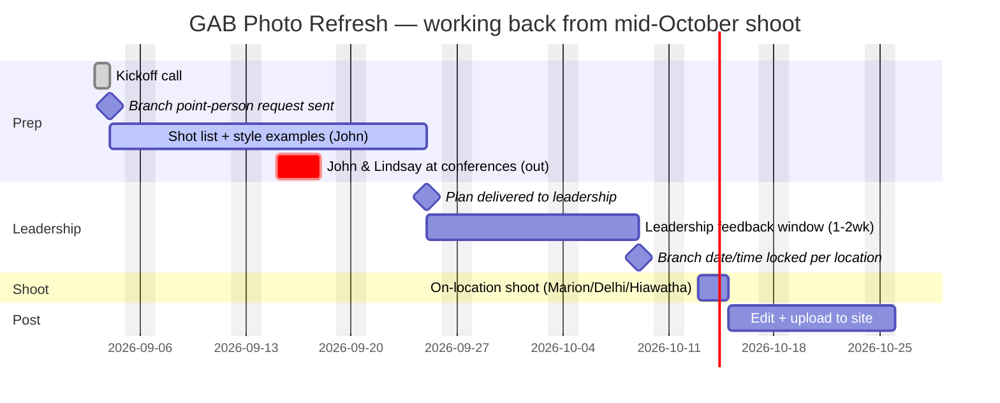

# GreatAmerica Bank Website Photo Refresh

Ongoing project — kicked off 2026-09-03, on-location shoot targeted **mid-October 2026** (pushed back from an earlier date by Chris Carlson's exterior signage timeline). Replaces the stock photography on greatamericabank.com with licensed/on-location editorial photos across the three branches (Marion, Delhi, Hiawatha).

**Team:** John Wiedenheft (site/shot-list owner), Jessen (photographer, on-site), Ben (directing/b-roll/drone).

## Folder contents
- [PROJECT-2026-09-04.md](PROJECT-2026-09-04.md) — everything below, plus the audit and transcript, combined into one file
- [kickoff-transcript-2026-09-03.md](kickoff-transcript-2026-09-03.md) — full transcript of the 9/3 kickoff call (Deepgram, diarized — speaker labels confirmed by John)
- [photo-audit-2026-09-03.md](photo-audit-2026-09-03.md) — every page on greatamericabank.com and the stock photo currently on it; this is the base for the shot list John owes Jessen

## Timeline

Worked backward from a mid-October shoot. Key constraint: **John and Lindsay are both out Sep 15-18** (different conferences) — that week is dead for prep progress and for any leadership decision-making, so the plan doesn't lean on it.

*(Shoot date is still "mid-October," pending Chris Carlson's signage timeline — Oct 13-15 shown as a placeholder. Delivering the plan by 9/25 leaves the full 2-week feedback window before that, with the blackout week already excluded from Lindsay's side. Branch point-person replies are needed by ~10/9 too, so the actual shoot day/time is locked before the crew travels.)*

## Decisions from the kickoff call
- **Style target:** editorial, not stock — same bar as GA.com's editorial photography. US Bank's site was cited as an aspirational benchmark (well-composed, not on-the-nose "banking" imagery, not a small thumbnail).
- **Priority order:** hero images first (biggest visual impact, currently gradient-behind-stock or small thumbnails), then location/branch shots, then personal-banking interaction shots, then business-banking.
- **Interaction scenarios to shoot:** teller desk, drive-through, loan officer's desk — identified as the three core personal-banking scenarios.
- **Community/place shots:** welcome-to-town signage (Marion, Delhi), downtown/Main Street shots, Thomas Park, the pedestrian bridge — meant to signal "place in the community," not literally "bank."
- **Building exteriors:** add people to establishing shots so they don't read as just architecture; Ben to bring a drone for aerial/establishing shots of each branch.
- **Mobile app imagery:** still likely a generic "person holding phone" stock/mockup shot — low priority, but it's a repeating module across the site so worth getting a good one.
- **Approval-first, not shoot-first:** explicit call-out that leadership (Lindsay, and whoever else) doesn't offer opinions on bank marketing until something's already wrong (referenced Scott Geistkemper's post-launch "why is this stock photography" email as the cautionary example). Plan is to build a mood board + shot list and get sign-off *before* spending three shoot days on it.

## Action items
| Owner | Item | Due |
|---|---|---|
| John | Email Lindsay, Tammy, Brian Bjella requesting a point person at each branch (Marion, Delhi, Hiawatha) to schedule shoot date/time | Sent 2026-09-04 (draft below) |
| John | Follow up on point-person email if no reply | By 2026-09-11 (before the 9/15-18 blackout) |
| John | Build page-by-page shot list from the photo audit (which stock images get replaced, with what) | 2026-09-25 |
| John | Pull editorial-style examples from other bank websites for the mood board | 2026-09-25 |
| John | Present full plan/mood board to leadership (Lindsay, Tammy, Brian) | 2026-09-25 |
| Jessen | Line up bank employees willing to be photographed (mentioned: Seth, Barb as possibles) | Before shoot |
| Jessen + Ben | On-location shoot, 3 branches, incl. b-roll/video footage | Mid-October |
| Ben | Drone exterior/establishing shots per branch | Mid-October |

## Correspondence
- [branch-point-person-email-2026-09-04.txt](branch-point-person-email-2026-09-04.txt) — draft to Lindsay, Tammy, Brian Bjella requesting a branch point person + flagging the plan timeline

## Open questions
- **Who actually approves this?** John: "I don't know who's involved" — John owns the bank site "on paper," per Lindsay — but Scott/Martin/Adrian may also need to weigh in on approval. Same ownership-gap pattern as the MKB board prioritization issue elsewhere in the org.
- **Can GreatAmerica (parent co.) employees appear on the bank site**, or does it stay strictly the ~10-12 bank employees? Raised by Jessen, traces back to an Adrian email; unresolved.
- **Who's the "face" for business banking?** Tammy suggested (family sold the bank to GreatAmerica) but described as "less photogenic" — no clear alternative identified.
- **Foliage timing risk:** mid-October shoot may land after peak fall color; Ben noted AI tools (Artlist) could adjust season in post if needed.
- Existing employee headshots (Turpen, Golobic already used in the audit) — worth checking what's usable before scheduling new sessions for those people specifically.
